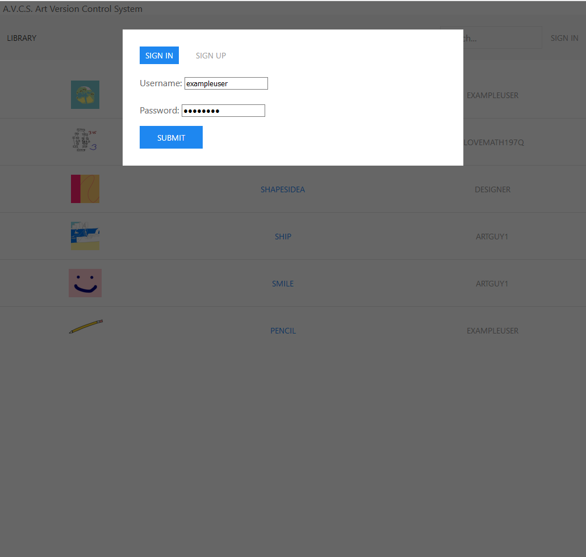

# Art-Version-Control-System-One
Art Version Control System One is website that acts as a version control system for photoshop and image files. Once signed in to their account, the user can create new projects and upload files to their projects in order to create a back ups of the current version of their projects. New projects can be created as public or private projects. If a project is public it will be viewable to all users on the "Public Library" page. If a project is private then it will only show up in the user's "My Library" page once signed in. As the user continues to work on their project they upload the project's file when they have made progress that they want to back up to there AVCS project. The user can then view each version of each project, download and delete any version they desire. Only the user that created the project can upload new version, delete versions, or delete the entire project. All users are able to download and view each project. This system allows the user to see the progression of their project and also easily revert back to a pervious version of their project.

## Details
### Dependencies:
  ```Node.js version 10.13.0```

### Technologies


## Screenshots

### Default Home Page (Public Library)

### Sign up - Account Creation

### Sign in

### My Library

### Library Switcher (My Library/Public Library)

### Public Library While Signed In

### Create New Project

### Detailed View Of A Project

### View Option Picker (View Mode/Edit Mode)

### Edit Mode - Delete Version

### Edit Mode - Delete Project

### Dynamically Updating Search on Public Library

### Detailed View of A Project (Not Signed In)


## Current Limitations:
  -
## Future Plans
In Future I would like to implement functionality such as:
  - support for multiple accounts
  - project deletion
  - version deletion
  - multi file versions
  - hosted
